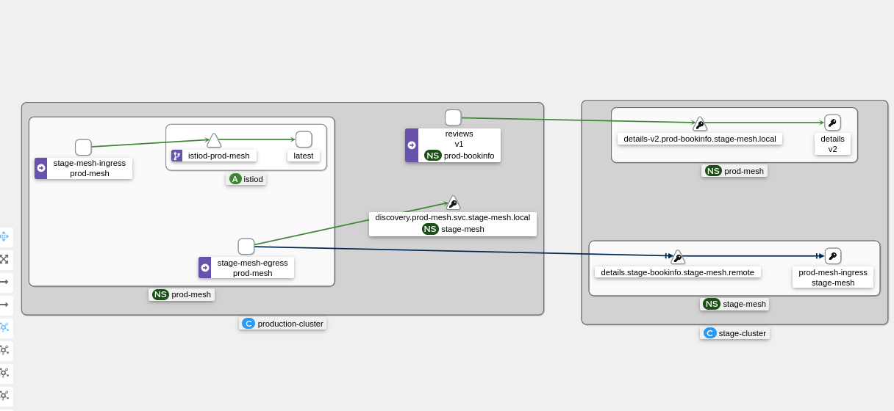
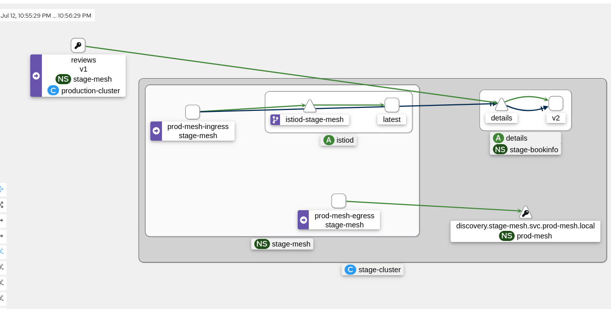

# Test that the mesh federatio is in function
You can continously provide requests from review pod terminal in prod mesht to test the peering. All request should be mirrored to stage


```
watch curl -vvv http://details-v2.prod-bookinfo.svc.stage-mesh-imports.local:9080/details/0
```

You than be able to see the meshing in Function from Kiali.

## Prod-mesh Kiali view




## Stage-mesh Kiali view

